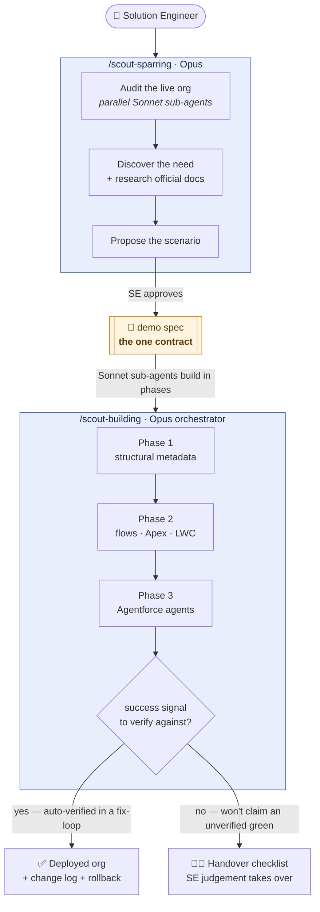

# SF Demo Scout

A Claude Code plugin for Salesforce Solution Engineers. Scout audits your
demo org, spars with you on the scenario, and deploys the configuration —
so you ship a CLI-driven demo this week instead of next quarter.

## Why Scout exists

The SE role is shifting. We're increasingly asked to do post-sales
activation work — configuring real Salesforce orgs through CLI-native
tools that didn't exist 18 months ago — and the gap between what the
platform now expects and what most of us trained for is real. The tooling
landscape doesn't help: a dozen MCP servers, community skill repos, half a
dozen ways to stand up Claude Code. The cost of starting is high, and the
cost of starting wrong is higher.

Scout is the on-ramp. One command stands up everything you need, and from
there it does three things:

1. **Audits the org you're connected to** — a complete snapshot of what
   already exists, so you build into reality instead of around it.
2. **Spars with you on the scenario** — guided discovery from customer
   notes, Salesforce Docs, and Slack, through to a structured deployment
   spec you approve before anything is built.
3. **Builds the configuration** — an Opus orchestrator spawns Sonnet
   sub-agents that deploy in phases, validate each step against the live
   org, and produce a change log with rollback commands.

Scout works because the [official Salesforce deployment
skills](https://github.com/forcedotcom/sf-skills) are baked in, with an
orchestration layer for SEs on top. Rather than improvising Apex, Flow
XML, or agent metadata from training data, it uses the same authoring
rules and validation patterns the platform team publishes. You're not
vibe-coding the platform layer — you're driving it.

## How it works

Two Opus-driven conversations feeding a Sonnet-executed build, with a
single spec file as the only contract between them — sparring is its sole
writer, building its sole reader. That one seam is what keeps a
multi-agent system legible enough to trust on demo day.



## What Scout builds, and what it doesn't

The point of Scout is not to replace SE expertise, and it is not an
autopilot. It could have been — the tooling makes almost everything
buildable. But once everything is buildable, the scarce discipline is
deciding what *not* to hand to the machine. So every capability sits in
one of four tiers, and the line between them is a single test: **is there
a success signal Scout can check its own work against?**

Where a signal exists — a deploy read-back, a passing Flow test, a fired
agent action — Scout runs autonomously inside a bounded fix-loop. Where
none exists, it stops and hands you a checklist rather than claim a green
it can't verify.

| Scout handles automatically | SE judgement takes over |
|---|---|
| Custom objects, fields, record types | Complex / multi-screen & orchestration flows |
| Permission sets (incl. companion sets) | Complex page-layout visual arrangement |
| Lightning apps, tabs, queues | Dashboards, Data 360, Tableau, OmniStudio |
| Record-triggered, screen & scheduled flows | Multi-agent orchestration & channel assignment |
| Apex & simple LWC (bounded test-fix loop) | Anything with no readable success signal |
| Agentforce agents (deploy, activate, smoke-test) | Anything destructive, without explicit confirmation |

**Showtime** mode collapses the loop for live discovery: it turns a
conversation happening in front of the customer into a scoped, deployed
proof-of-concept before the meeting ends — five hard scenario envelopes,
so the live deploy is a guarantee, not a hope.

## Install

Inside Claude Code, run these four commands in order:

```
/plugin marketplace add https://github.com/seb-schi/sf-demo-scout.git
/plugin install sf-demo-scout@scout
/reload-plugins
/scout-setup
```

When prompted on the install step, select `Install for you (user scope)`.
`/scout-setup` handles all prerequisites: Homebrew check, Node / Python /
Salesforce CLI install, SFDX scaffold, community skills sync, shell
environment, and Slack MCP registration + auth.

After setup, kick off your first demo with `/scout-sparring`.

> **Full setup guide with videos and screenshots:**
> [Demo Scout Canvas](https://salesforce.enterprise.slack.com/docs/T01G0063H29/F0AQP1A7YMD)
> (internal Salesforce link)

## The four commands

| Command | What it does |
|---|---|
| `/scout-sparring` | Guided sparring + spec generation (Opus; Sonnet sub-agents audit your org) |
| `/scout-building` | Org deployment from a completed spec (Opus orchestrates, Sonnet sub-agents build) |
| `/scout-switch-org` | Switch between demo orgs, or connect a new one |
| `/scout-setup` | Setup, updates, and repairs |

## Updates

Updates are automatic. Claude Code pulls new plugin versions on session
startup; if an update is downloaded but not yet installed, you'll see a
one-line banner suggesting `/scout-setup` to finish. To trigger manually:
`/plugin marketplace update scout`.

## Adoption

Scout began as unfunded personal work and grew into shared SE tooling —
piloted live at World Tour Frankfurt, forked by the US Regulated FDE org
for live customer orgs, and cloned 200+ times across a 100+ member SE
community spanning EMEA and AMER.

## Archive

The full clone-install history is preserved at branch
`archive/clone-install-final` and tag `v-clone-install-final`.

## Questions

Ping `#sf-demo-scout` on Slack.

---

Built by **Sebastian Schickhoff** — Lead Solution Engineer, Applied AI &
Regulated Industries · [sebastian-schickhoff.com](https://sebastian-schickhoff.com)
